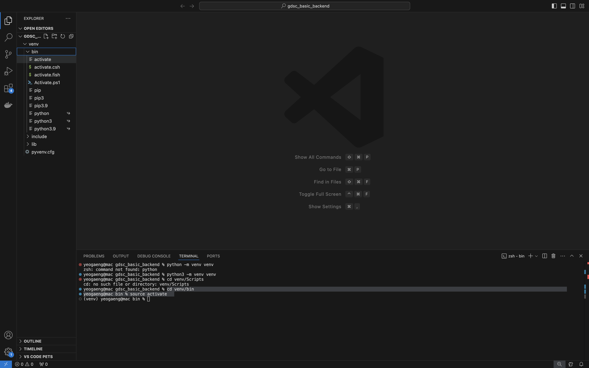

# 3주차

venv 시작

```bash
python3 -m venv venv
cd venv/bin
source activate
```



## 장고 설치

```bash
pip3 install django
```

설치 후 

```bash
django-admin --version
```

버전 확인 명령어로 설치 된 것을 확인


현재 여기니까

projet로 이동하기 위해 아래의 명령어 사용. 근데 이거말고 걍 vscode에서 만들어도됨

```bash
(venv) yeogaeng@mac bin % cd ../..
(venv) yeogaeng@mac gdsc_basic_backend % mkdir project
(venv) yeogaeng@mac gdsc_basic_backend % cd project
(venv) yeogaeng@mac project % 
```

프로젝트로 들어가서 config 파일 만들자

```bash
(venv) yeogaeng@mac project % django-admin startproject config .
```

띄어쓰기 후 마침표 주의!


그러면 알아서 config 폴더가 채워진다. 프로젝트에서 사용할 [settings.py](http://settings.py/), urls.py등이 생성된다.

## 장고 프로젝트 실행

```bash
python manage.py runserver
```


그리고 127.0.0.1:8000으로 접속하면


짜잔~

### [settings.py](http://settings.py) 변경


언어와 시간 설정 변경 후 저장 


## 어플리케이션 실행

```bash
django-admin startapp questions
```

⇒ questions 폴더 안에 [models.py](http://models.py/), [views.py](http://views.py/) 등이 생긴걸 볼 수 있음
templates는 직접 만들어줘야함


앱을 만들면 [settings.py](http://settings.py/) 에 우리가 만든 questions app을 등록해줘야한다.
INSTALLED_APPS 에‘questions.apps.QuestionsConfig’를 추가하자


그리고 실행 했을 때 별 문제 없으면 됨